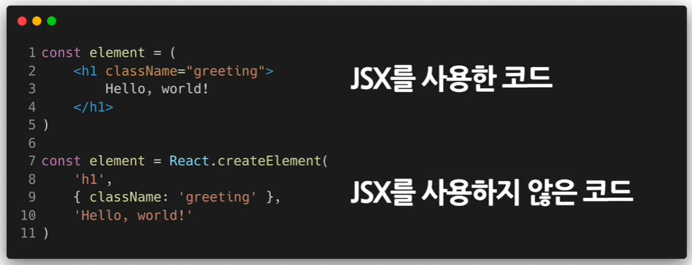
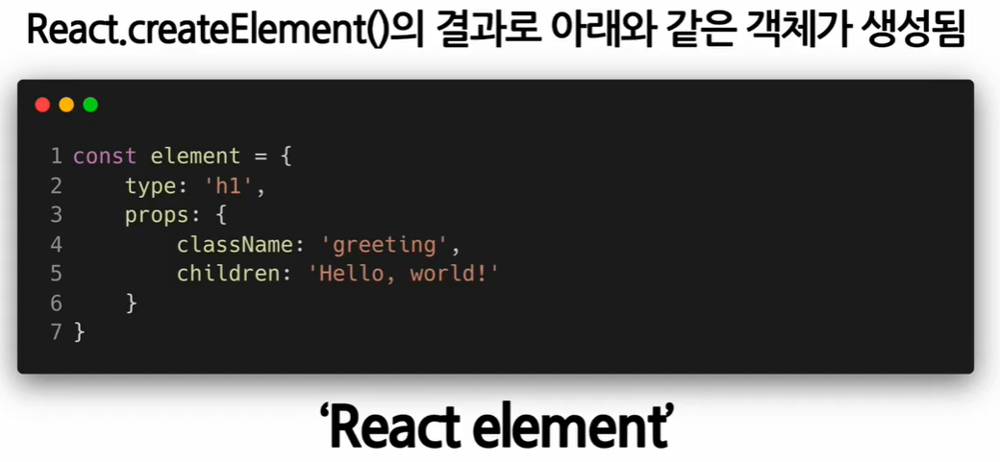
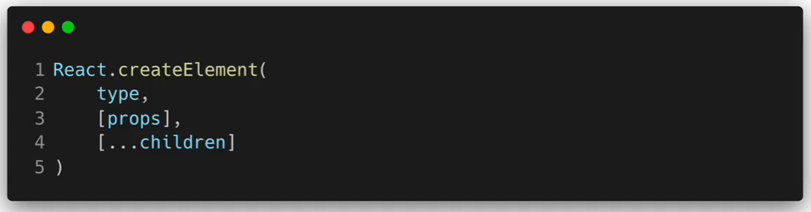
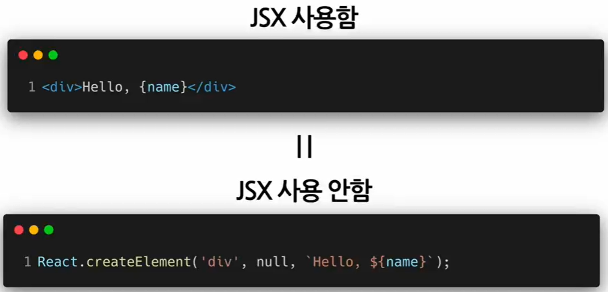
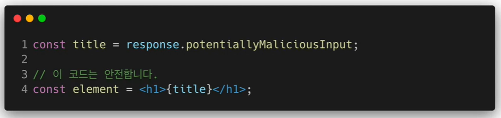
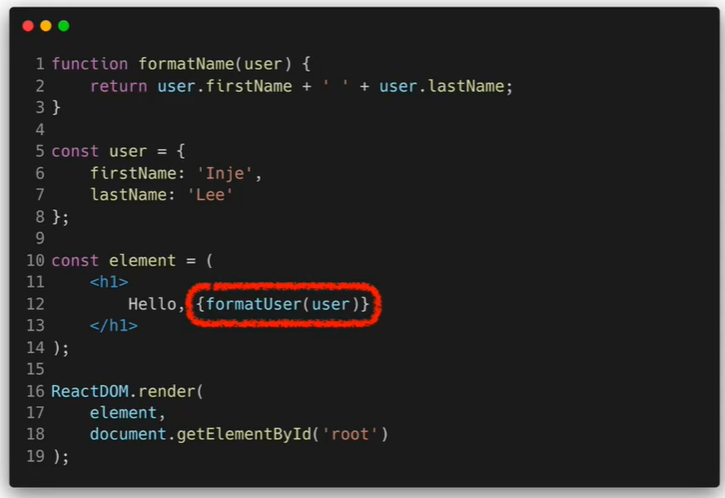
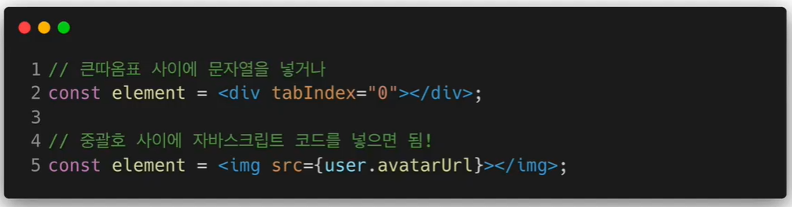
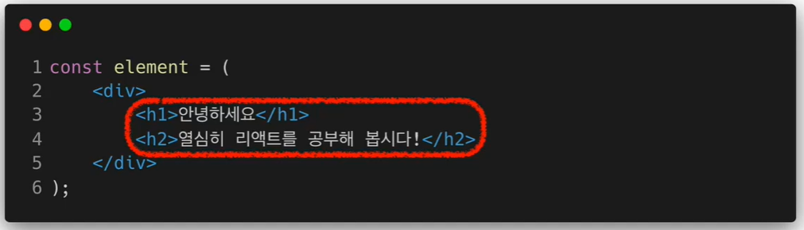

# JSX

## JSX의 정의와 역할

* `JS` <= JavaScript

* `JSX` <= A syntax extension to JavaScript : 자바스크립트 확장 문법

  = **J**ava**S**cript + **X**ML / HTML

* 예시

  ```jsx
  const element = <h1>Hello, world!</h1>;
  ```

### 역할

* XML/HTML 코드를 JS로 변환

  * 최종적으로 나오는 건 JavaScript 코드!

* 예시

  **JSX를 사용한 코드**

  ```jsx
  class Hello extends React.Component {
      render() {
          return <div>Hello {this.props.toWhat}</div>;
      }
  }
  
  ReactDOM.render(
  	<Hello toWhat="World" />,
  	document.getElementById('root')
  );
  ```

  **JSX를 사용하지 않은 코드**

  ```javascript
  class Hello extends React.Component {
      render() {
          return React.createElement('div', null, `Hello ${this.props.toWhat}`);
      }
  }
  
  ReactDOM.render(
      React.createElement(Hello, { toWhat: 'World' }, null),
  	document.getElementById('root')
  );
  ```

  



* **createElement 함수의 파라미터**



1. type: 유형. div나 span같은 html 태그 또는 다른 리액트 컴포넌트가 들어갈 수도 있다
2. props : 속성들
3. children: element가 가지고 있는 자식

<br/>

## JS의 장점 및 사용법

### 장점

* 간결해짐

  

* 가독성 향상

  => 버그를 발견하기 쉬움

* Injection Attacks 방어

  * 입력상의 문자나 숫자 같은 일반적인 값이 아니라 코드를 넣어서 실행 시키는 해킹 방법

    => CSS 방어 가능(Cross-site Scripting)

    

<br/>

### 사용법

* XML/HTML 사이에 `{}`를 사용해서 JavaScript 코드를 사용

  

* 태그 속성에 값을 넣는 방법

  

* 자식(children)을 정의하는 방법

  

<br/>

## (실습) JSX 코드 작성해보기

