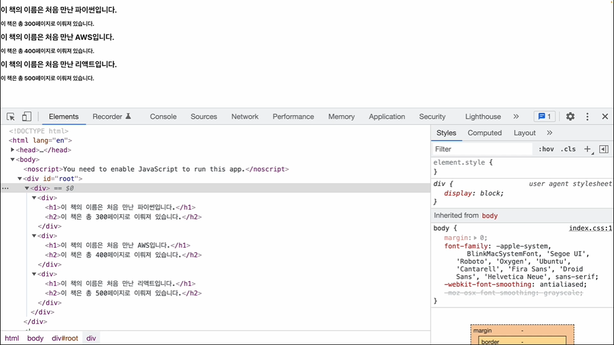
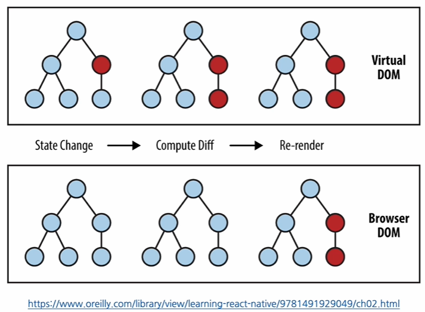
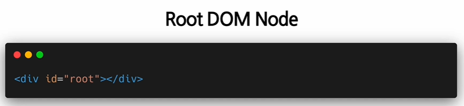

# Rendering Elements

## Elements의 정의와 생김새

### Elements

* 영어단어 : 어떤 물체를 구성하는 성분, 요소

* React.js : `Elements are the smallest building blocks of React apps`

  리액트 앱을 구성하는 가장 작은 블록들

* DOM의 elements

  

* Virtual DOM에 존재하는 게 리액트의 엘리먼트

  => React Elements는 DOM Elements의 가상 표현

  * 리액트 Elements는 자바스크립트 객체 형태로 존재 (불변성!)
    * DOM Elements는 React Elements에 비해서 더 많은 정보를 담고 있으므로 크고 무거움

 

## Elements의 특징 및 렌더링하기

### immutable 불변성

* elements **생성 후**에는 children이나 attributes를 바꿀 수 없다

*  virtual DOM 다시 보기

  * elements는 불변성을 갖고 있으므로, 새로운 부분을 보여주기 위해서는 새로운 elements를 생성해서 연결해서 보여줘야함

  

 

### 렌더링 하기

* 생성 후, 화면에 보여주기 위해서는 `렌더링`이라는 과정을 거쳐야 한다

* React 필수 태그

 

### 렌더링 된 elements 업데이트하기

* 불변성 때문에 업데이트를 위해서는 `다시 생성`해야한다

