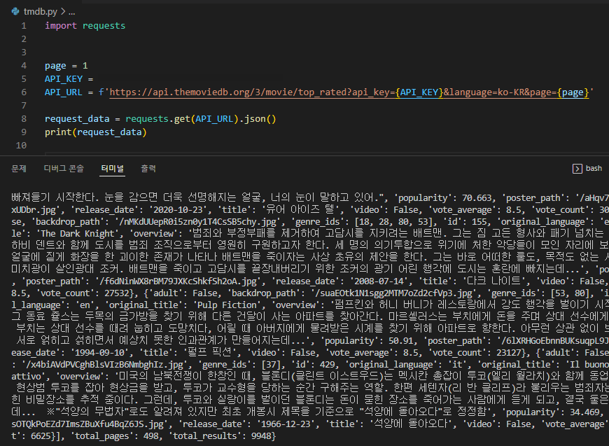

## API에서 데이터 받아서 DB에 저장하기

1. API에서 DB로 직접 저장
2. JSON 파일로 변환하여 DB로 저장
3. CSV 파일로 저장한 후 DB로 저장

<br/>

## May 18, 2022 | CSV 파일로 저장한 후 DB로 저장

1. JSON으로 데이터 받는 것 확인

   

2. pandas 설치

   ```bash
   $ pip install pandas
   ```

   