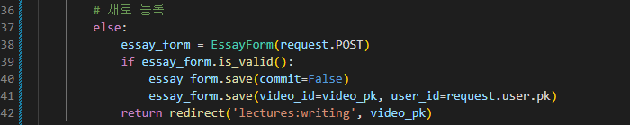
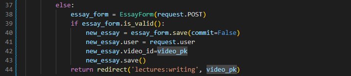
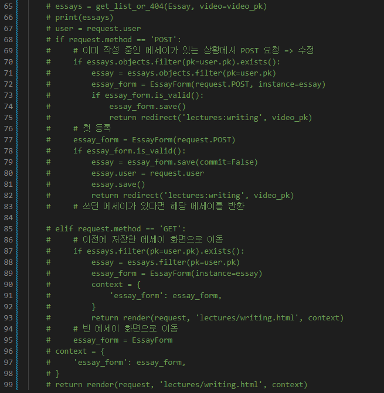
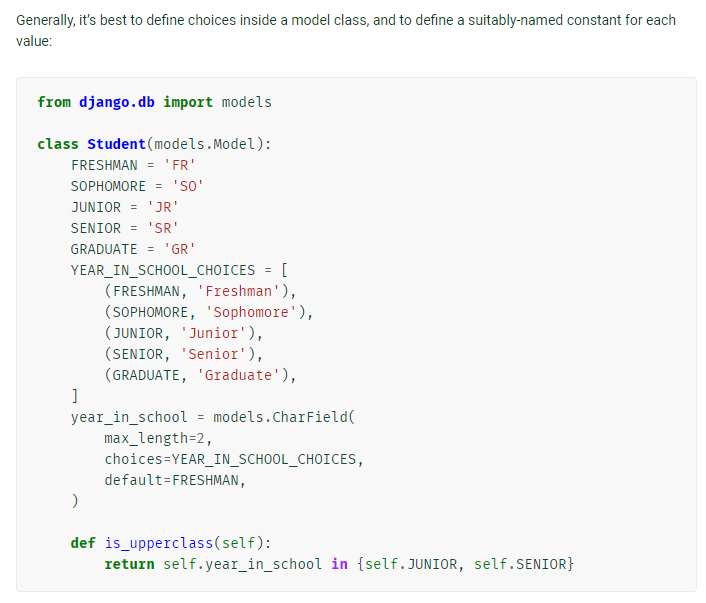

# 5월 9일 TIL

## 오늘의 목표

* `lectures/views.py`에서 essay함수 완성하기
* ERD
* 체크리스트 만들기

 

## 01 essay 함수

* `form.save(commit=False)`

  * 잘못된 코드와 오류 메시지

    

    

  * pjt07 참고

    

  * 수정 후

    

    * 그치만 참조할 2번 비디오가 없어서 오류...

      

    * 추가 후

      

* 타산지석으로 삼을 코드 ^_^

  

 

## 02 ERD

 

## 03 체크리스트 만들기

* studylog 모델 설정

  * ChoiceField는 없다 => CharField를 리스트와 연결 해주는 것 [공식 문서](https://docs.djangoproject.com/en/4.0/ref/models/fields/#choices) [참고 블로그](https://ssungkang.tistory.com/entry/Django-ChoiceField-%EC%82%AC%EC%9A%A9%ED%95%98%EA%B8%B0)

    

 

## 공부해야 할 것

* 체크리스트
  * DB에서 단어 받아와서 split() => list에 담아서 넘기기
  * [참고 블로그](https://maximum-curry30.tistory.com/260)